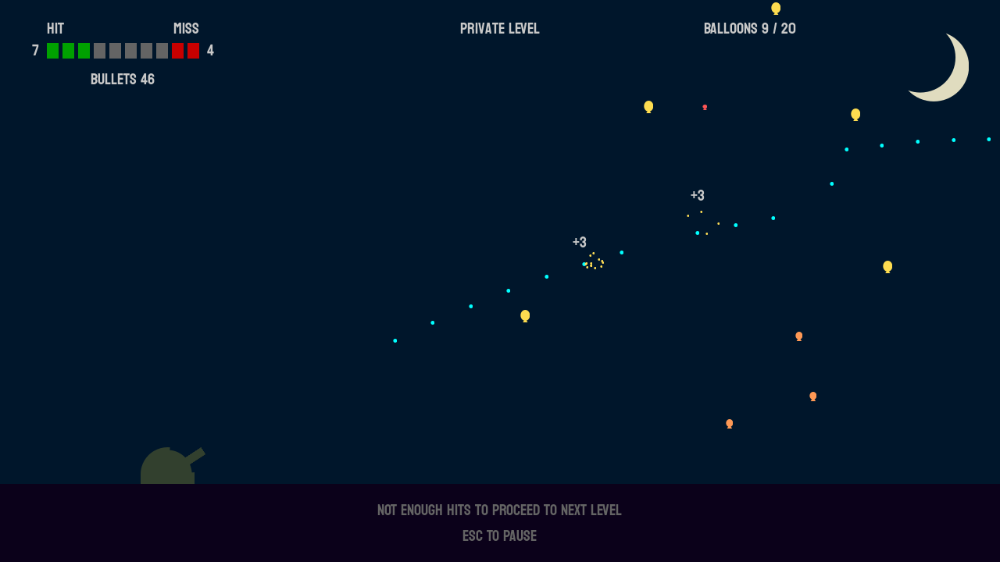

# Midnight Balloon Murder

A small video game with late 80s vibes, written in C using SDL2.

## Acknowledgements

_This project was bootstrapped using [Copier](https://pypi.org/project/copier) and the [Copier template for C projects](https://github.com/jspaaks/copier-template-for-c-projects)._
